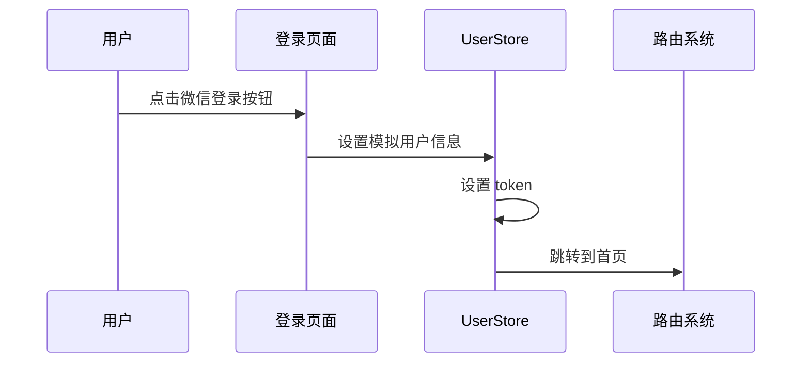
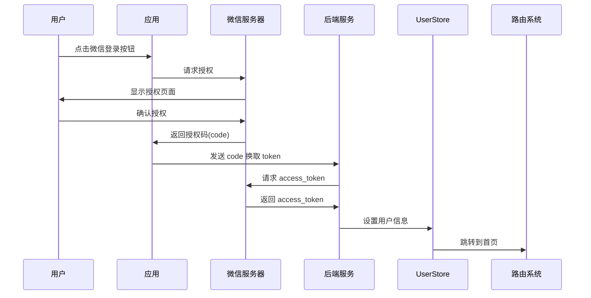

# Companion 登录流程文档

## 一、登录入口

### 1. 触发登录的场景

- 用户首次访问需要登录的页面
- 用户 token 失效
- 用户主动点击退出登录
- 用户清除缓存后重新访问

### 2. 登录页面展示

- 页面路径：`/login`
- 页面组件：`src/views/Login.vue`
- 页面内容：
  - 应用 Logo 和标语
  - 微信一键登录按钮
  - 服务条款和隐私政策链接
  - 开发环境下的清理缓存按钮

## 二、登录流程

### 1. 开发环境登录流程



1. 用户点击"微信一键登录"按钮
2. 系统检测到开发环境，直接使用模拟数据：
   ```javascript
   const mockUserInfo = {
     openid: "oZdZL6hs_Jn4yFiJ2GWUuQyR0DhE",
     nickname: "开发测试",
     sex: 1,
     province: "广东",
     city: "深圳",
     country: "中国",
     headimgurl: testAvatar,
     privilege: [],
   };
   ```
3. 调用 `userStore.setUserInfo(mockUserInfo)` 设置用户信息
4. 调用 `userStore.setToken("dev_token")` 设置 token
5. 路由跳转到首页

### 2. 生产环境微信登录流程



1. 用户点击"微信一键登录"按钮
2. 系统构建微信授权 URL：
   ```javascript
   const appid = process.env.VUE_APP_WX_APPID;
   const redirectUri = encodeURIComponent(
     `${process.env.VUE_APP_WX_REDIRECT_URI}/wx-auth`
   );
   const scope = "snsapi_userinfo";
   const state = encodeURIComponent(redirect);
   ```
3. 跳转到微信授权页面
4. 用户在微信中确认授权
5. 微信服务器重定向回应用，并携带授权码(code)
6. 应用接收 code 并调用后端接口 `wxLogin(code)`
7. 后端服务：
   - 使用 code 向微信服务器请求 access_token
   - 使用 access_token 获取用户信息
   - 生成应用 token
   - 返回用户信息和 token
8. 前端处理：
   - 存储 token
   - 存储用户信息
   - 初始化账户余额
   - 跳转到首页

## 三、数据流转

### 1. 状态管理

- 使用 Pinia 管理用户状态
- 主要状态：
  ```javascript
  {
    token: "",          // 认证令牌
    openid: "",         // 微信 openid
    userId: "",         // 用户 ID
    userInfo: null,     // 用户信息
    role: 1,            // 用户角色
    systemTags: [],     // 系统标签
    userTags: []        // 用户标签
  }
  ```

### 2. 持久化存储

- token 存储在 localStorage
- 用户信息通过 Pinia 持久化插件存储

### 3. 路由守卫

```javascript
router.beforeEach(async (to, from, next) => {
  if (to.meta.requiresAuth && !userStore.isLoggedIn) {
    next({ path: "/login", query: { redirect: to.fullPath } });
  } else {
    next();
  }
});
```

## 四、错误处理

### 1. 登录失败处理

- 显示错误提示
- 记录错误日志
- 允许用户重试

### 2. 授权失败处理

- 显示授权失败提示
- 提供重新授权选项
- 记录错误日志

### 3. 网络错误处理

- 显示网络错误提示
- 提供重试机制
- 记录错误日志

## 五、安全考虑

### 1. 数据安全

- 使用 HTTPS 协议
- 敏感信息加密传输
- token 安全存储

### 2. 授权安全

- 使用 state 参数防止 CSRF 攻击
- 验证授权回调域名
- 定期刷新 token

### 3. 用户隐私

- 最小权限原则
- 用户数据脱敏
- 隐私政策说明

## 六、开发调试

### 1. 开发环境配置

```javascript
// .env.development
VUE_APP_SKIP_AUTH = true;
VUE_APP_USE_MOCK = true;
```

### 2. 调试工具

- Vue DevTools
- 网络请求监控
- 状态管理监控

### 3. 测试数据

- 模拟用户信息
- 模拟接口响应
- 错误场景测试
